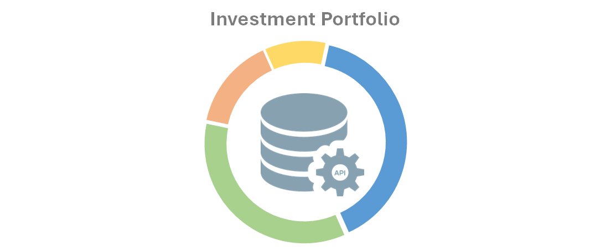
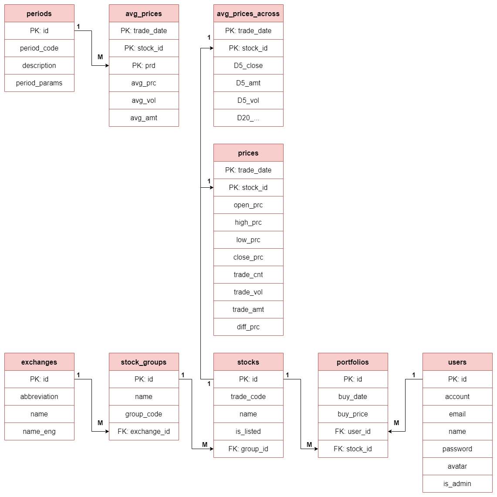
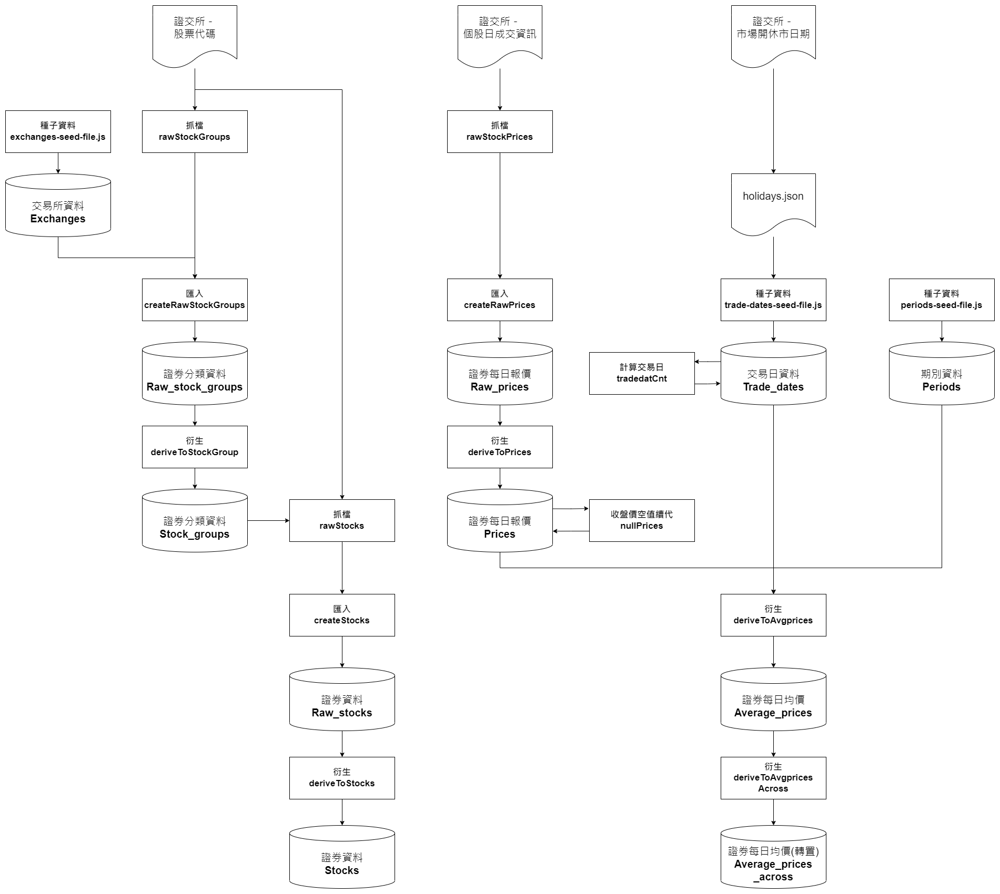

# Investment Portfolio API


__本專案僅做研究用途__

## 專案簡介
> 此專案能記錄投資組合，並以網路爬蟲擷取交易資料到本地端資料庫！  
以API發送投資組合、股票價格等資訊，達成前後端分離。

### 架構
1. 關聯資料庫(設計圖列於文末)：
    - Raw系列：儲存爬蟲的原始資料。
    - Stock系列：衍生爬蟲資料。
    - 其他系列：記錄使用者資訊、投資組合等互動資料。

2. APIs:
    - API文件 ***[(Link)](https://plain-foundation-7e1.notion.site/API-Investment-Portfolio-43fe6058ae8f4744bdaab0370c7f3521?pvs=4)***
    - RESTful API
    - 連線測試：Postman
    - 錯誤驗證
    
### 資料庫功能
0. 資料來源
    - **臺灣證券交易所** _(TWSE)_
1. 儲存網路爬蟲資料
    - 起訖日資料
        - 證券分類
        - 證券資料
    - 日資料
        - 證券報價
2. 資料衍生相關
    - 資料處理
        - 續代收盤價
        - 轉換漲跌價格
        - 計算累計交易日等
    - 衍生資料庫
        - 證券每日**平均價格**
        - 交易日期等
3. 記錄使用者操作資料
    - 使用者資料
    - 投資組合資料庫
 
### API功能
1. 帳號註冊及登入
    - 帳號註冊
    - 登入機制：**JWT(JSON Web Token)** 。
    - 前後台登入路徑分離及身分驗證。
 
2. 主頁面
    - 在主頁能看到漲跌幅前十大股票等資訊。
    - 能進一步查看單一證券的報價。
    - 可以搜尋證券。

3. 使用者功能(需登入)
    - **能夠記錄投資組合**，如證券代號、買入日期、買入價格及單位等。
    - 能夠修/修Portfolio的資料。
    - 能在同一畫面看到證券最新價格(不含息)。
    - 提供每一檔證券的**買入成本、持股數及損益**等資訊。
    - 提供總投資成本及損益等資訊。
  
4. 後台功能
    - 管理員可於後台查看股票分類、股票資訊等**屬性**資料。
    - 管理員可於後台新/刪/修上述資料。
***

## 環境需求與相關套件
1. Node.js
2. MySQL (MySQL Workbench 8.0)
3. Postman
4. 環境檔(.env)

## 專案初始化流程
1. clone此專案到本地端。
2. 開啟終端機，在專案資料夾執行：
```bash
cd [filePath]  # [filePath]為專案資料夾的路徑
npm init -y
```
3. 在終端機安裝套件(請見**package.json**的`dependencies`和`devDependencies`)：
```bash
# 安裝dependencies的套件
# 以"express": "^4.18.1"為例，執行
npm install express@4.18.1
```
```bash
# 安裝devDependencies的套件
# 以"dotenv": "^16.3.1"為例，執行
npm install -D dotenv@16.3.1
```
4. 環境檔－在目標資料夾新增副檔名為**env**的檔案，內容包括DB連線和JWT的設定。
私密資訊皆紀錄在**env.example**。

```javascript
// .env的內文
JWT_SECRET=[yourSecret] // [yourSecret]為您的私密資訊
```
5. 請在MySQL Workbench建立資料庫
```sql
create database [database_name]  -- [database_name]為資料庫/Schema的名稱
CHARACTER SET utf8mb4
COLLATE utf8mb4_unicode_ci;
```

6. 請在終端機輸入以下指令，導入Migration和Model到MySql中。
```bash
npx sequelize db:migrate
```

7. 種子資料－請將種子資料匯入DB，做為初始化的測試資料。
```bash
npx sequelize db:seed:all
```
8. 在終端機啟動伺服器，成功或失敗皆會有通知訊息。
```bash
# 啟動方法1
npm run start (node app.js)
```
```bash
# 啟動方法2
npm run dev (nodemon app.js)
```
9. 匯入下列設定至Postman ，即可測試API。
- Collection - Home: `data/postman/Home.postman_collection.json`
- Collection - Signin: `data/postman/Signin.postman_collection.json`
- Collection - Portfolio: `data/postman/Portfolios.postman_collection.json`
- Collection - Admin: `data/postman/Admin.postman_collection.json`
- Environment: `data/postman/Local.postman_environment.json`
***

## 資料庫使用說明
資料庫的操作及對應函式都記錄在`package.json`的`script`。  
請依照使用需求，在終端機執行：
```bash
npm run [程式]
```
### 程式名稱及功能
- `stock`：

  - 執行**證券分類**的爬蟲程式
  - 執行**證券代號及名稱**的爬蟲程式
  - 可自行設定定時器的秒數在變數`TIMER`
```javascript
const TIMER = 10000  // 定時器
```
- `rawPrice`：
  - 執行**證券每日報價**的爬蟲程式
  - 若要爬蟲歷史資料，可以到**helpers/date-helpers.js**修改`getMonth`或`getYear`函式
  - 建議使用者先**設定資料起日**再執行此程式


- `price`：
  - 執行**證券每日報價**的**衍生**程式
  - 續代未成交的報價、處理漲跌價格等。
  - 註：部分未成交證券的報價續代可能需要重覆執行。

- `avgPrice`：
  - 執行**證券每日平均價格**的爬蟲程式
  - 可自行設定資料日期在變數`DATA_DATE`
  
```javascript
const DATA_DATE = '2023/9/1'  // 資料日期
```

- `tradeday`：

  - 執行**累計交易日**的爬蟲程式
  - 後台新增完假日資料後，執行此程式。
***

## 相關設計
### 實體關係圖 (ERD)

### 資料流程圖 (DFD)


